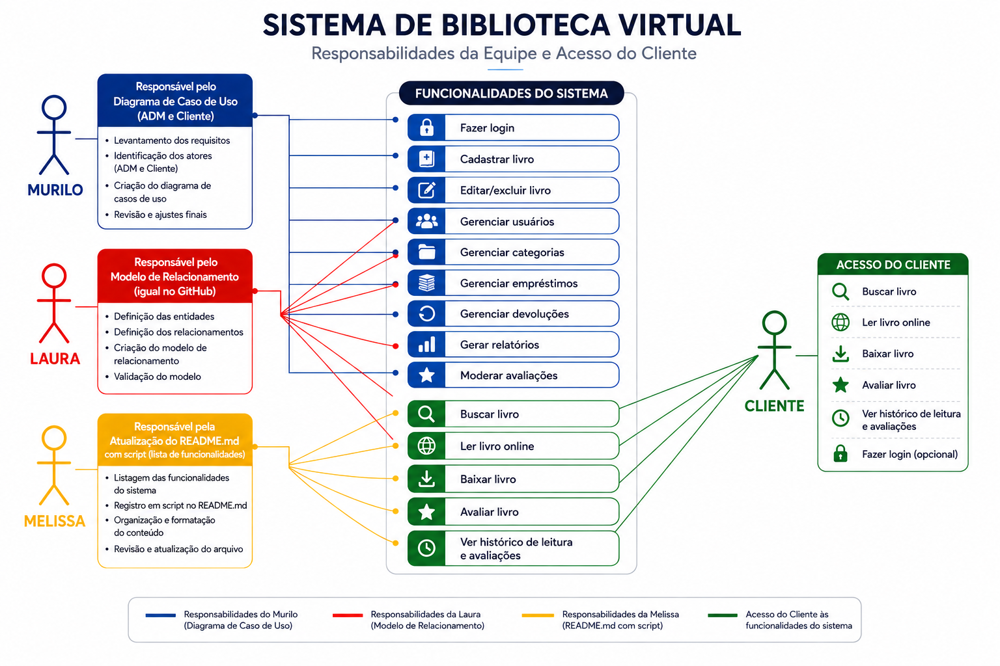

# Biblioteca Virtual 

>Levando a leitura da literatura brasileira para dentro das escolas públicas.


## Índice
- [Sobre o projeto](#sobre-o-projeto)
- [Funcionalidades](#funcionalidades)
- [Screenshots](#screenshots)
- [Como usar](#como-usar)
- [Tecnologias](#tecnologias)
- [Modelagem do projeto](#modelagem-do-projeto)
- [Licença](#licença)


## Sobre o projeto

A **Biblioteca Virtual** é um projeto voltado para estudantes de escolas públicas, com foco no acesso à literatura brasileira.

A proposta é criar uma plataforma digital simples e acessível, na qual os estudantes possam encontrar obras de autores nacionais, consultar informações sobre os livros e realizar suas leituras diretamente pela plataforma.

O projeto busca utilizar a tecnologia como uma forma de aproximar os estudantes da literatura brasileira e facilitar o acesso a diferentes obras e autores.


### Objetivo

O projeto tem como principais objetivos:

- Incentivar o contato dos estudantes com a literatura brasileira;
- Facilitar o acesso a obras de autores nacionais;
- Disponibilizar um catálogo digital organizado;
- Permitir a busca de livros por diferentes critérios;
- Criar uma experiência de leitura simples e intuitiva;
- Desenvolver uma aplicação integrando front-end, back-end e banco de dados.


## Proposta

A plataforma será organizada em duas áreas principais:

### Área do estudante

O estudante poderá acessar a biblioteca, encontrar livros e acompanhar seu histórico de leitura.

Entre as funcionalidades planejadas estão:

- Login do estudante;
- Catálogo de livros;
- Busca por título;
- Busca por autor;
- Busca por gênero;
- Leitura dos livros diretamente na plataforma;
- Histórico de leitura.

### Área administrativa

A área administrativa será responsável pelo gerenciamento do acervo da biblioteca.

Entre as funcionalidades planejadas estão:

- Login administrativo;
- Cadastro de livros;
- Consulta de livros;
- Edição de livros;
- Exclusão de livros;
- Gerenciamento do acervo.


#  Funcionalidades

>  O projeto está em desenvolvimento. As funcionalidades abaixo representam o planejamento da aplicação.

### Estudante

- [ ] Login do estudante
- [ ] Autenticação por e-mail e senha
- [ ] Visualização do catálogo
- [ ] Busca por título
- [ ] Busca por autor
- [ ] Busca por gênero
- [ ] Visualização das informações do livro
- [ ] Leitura do livro na plataforma
- [ ] Histórico de leitura

### Administrador

- [ ] Login administrativo
- [ ] Cadastro de livros
- [ ] Listagem de livros
- [ ] Edição de livros
- [ ] Exclusão de livros
- [ ] Gerenciamento do acervo


## Screenshots


## Como usar
1. Acesse a plataforma pelo navegador.
2. Faça login utilizando o **e-mail estudantil** e a **senha fornecida pela Sala do Futuro**.
3. Após o login, você terá acesso ao catálogo de livros da biblioteca.
4. Escolha um livro de literatura brasileira e comece a leitura.


## Tecnologias
- **Java** — lógica do back-end
- **HTML** — estrutura das páginas
- **CSS** — estilização visual
- **JavaScript** — interatividade no front-end
- **SQL** — banco de dados (cadastro de livros, usuários e acessos)


## Modelagem do projeto

O repositório possui os materiais utilizados para representar a estrutura e o relacionamento dos dados da aplicação.

### Diagrama da biblioteca



### Modelo de relacionamento


O arquivo editável do modelo de relacionamento também está disponível no projeto:

```text
biblioteca_virtual_modelo_relacionamento.mwb
